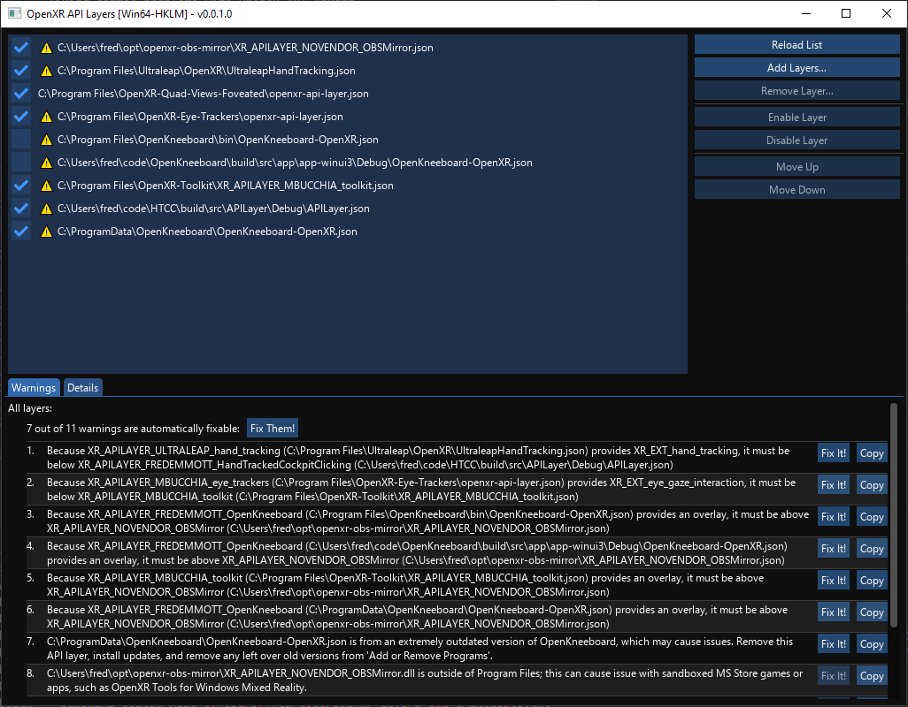
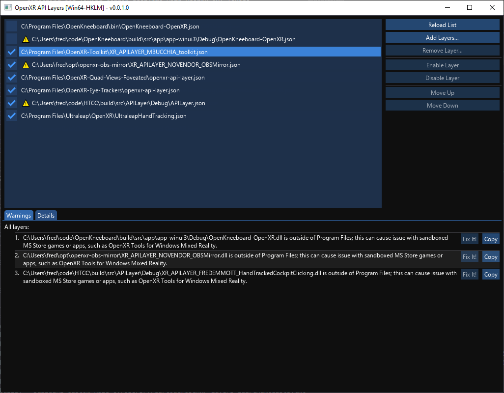
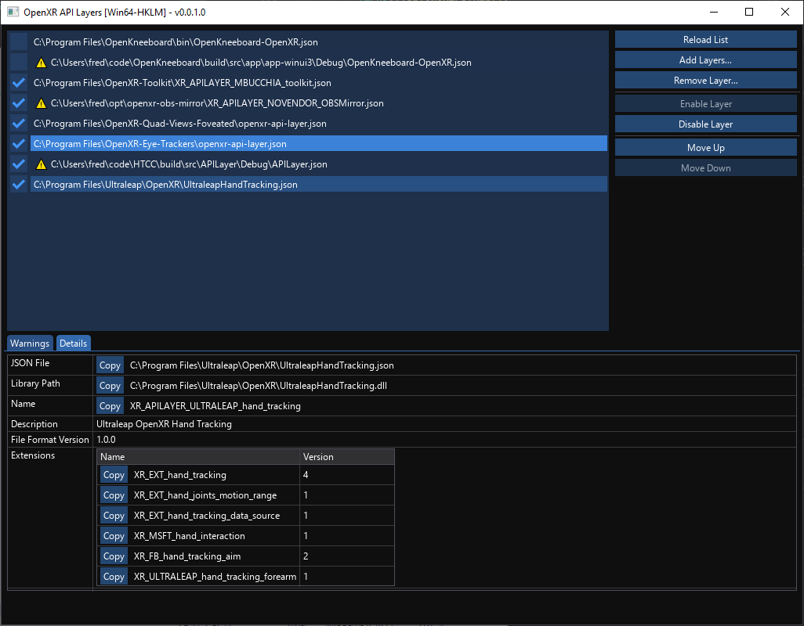

# OpenXR API Layers GUI

This is a tool for:
- detecting and fixing common problems with OpenXR API layers
- viewing information about OpenXR API layers
- enabling, disabling, adding, or removing OpenXR API layers
- re-ordering OpenXR API layers

There is no general way to detect errors with OpenXR API layers, so this tool is only able to detect problems that it knows about. If it doesn't show any errors, that just means that you have no particularly common problems, not necessarily that everything is set up correctly.

## Getting Started

1. Download [the latest version](https://github.com/fredemmott/OpenXR-API-Layers-GUI/releases/latest)
2. Extract it somewhere handy
3. Read the `README-Windows.txt` you just extracted :)

While this project is designed to be easily portable, it currently only supports Windows - [contributions are very welcome :)](CONTRIBUTING.md).

## Getting Help

If you have a problem with a specific layer, or aren't sure which order things
should be in, contact the developers of the relevant layers.

If you have a problem with *the tool*, not games or specific API layers, help
may be available from the community in [my
Discord](https://go.fredemmott.com/discord).

## Screenshots

Common errors are automatically detected:

Most errors can be automatically fixed; the 'Fix Them!' button in the screenshot produces this:

Detailed information about OpenXR API layers is also shown:

## Contributing

See [CONTRIBUTING.md](CONTRIBUTING.md).

## License

The majority of this project is licensed under the MIT license (below).

The images in the 'icons' subfolder may not be reused or distributed outside of this product.

A separate license for these images may be purchased from https://glyphicons.com

------

Copyright (c) 2023 Fred Emmott.

Permission to use, copy, modify, and/or distribute this software for any purpose
with or without fee is hereby granted, provided that the above copyright notice
and this permission notice appear in all copies.

THE SOFTWARE IS PROVIDED “AS IS” AND THE AUTHOR DISCLAIMS ALL WARRANTIES WITH
REGARD TO THIS SOFTWARE INCLUDING ALL IMPLIED WARRANTIES OF MERCHANTABILITY AND
FITNESS. IN NO EVENT SHALL THE AUTHOR BE LIABLE FOR ANY SPECIAL, DIRECT,
INDIRECT, OR CONSEQUENTIAL DAMAGES OR ANY DAMAGES WHATSOEVER RESULTING FROM LOSS
OF USE, DATA OR PROFITS, WHETHER IN AN ACTION OF CONTRACT, NEGLIGENCE OR OTHER
TORTIOUS ACTION, ARISING OUT OF OR IN CONNECTION WITH THE USE OR PERFORMANCE OF
THIS SOFTWARE.
